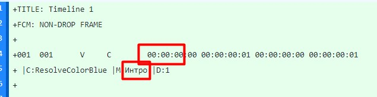

# davinci-markers-to-timecodes
When you edit a video in DaVinci Resolve you can create markers for chapters. Then you export markers to a file with some structure. This script helps you  to convert it from  .eld file to YouTube timecodes in .txt. It's written with ChatGPT for code_sisters.Talks().

### Instructions
Place exported .edl file to edls folder and run the script in IDE. It will create output file next input file.

### How it works
See files in \edls folder. Script takes first group of timecodes, strips las 3 chars. Then takes string between M and D (that's marker name) and outputs them as a pair on new line.

### Limitations
- Runs in IDE
- File structure may change. In this case create an issue.
